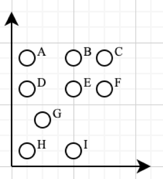

# Беспилотные автобусы на Манхеттене

Правительство Нью-Йорка решило запустить в городе беспилотные автобусы. Было решено начать с Манхеттена и поручить Добрыне разработать маршрутную карту.

Посмотрев на узкие улочки Манхеттена, Добрыня пришел к выводу, что не на каждом перекрестке автобусу хватит места, чтобы совершить поворот, поэтому первым делом Добрыня нашел все удобные для поворота перекрестки и обозначил их на карте.

Также Добрыня решил, что для сокращения рисков нужно минимизировать количество поворотов на маршруте каждого автобуса. Учитывая, что улицы на Манхеттене образуют сетку, и места для разворота на 180º на перекрестках нет, остался единственный вариант формы маршрута --- прямоугольной.

Придя к такому умозаключению, Добрыня задумался, а сколько вообще прямоугольных маршрутов через удобные перекрестки можно построить

Помогите Добрыне ответить на этот вопрос.

## Ограничения

Количество перекрестков в одном наборе данных не превышает `2*10^3`.

Все координаты перекрестков целочисленные, в отрезке `[-2147483648,2147483647]`.

Любой отрезок любого маршрута должен быть параллелен одной координатной оси.

## Пояснение к примерам

В единственном наборе входных данных представлены координаты перекрестков, приведенных ниже.



Несложно заметить, что в данном случае существуют только следующие 5 маршрутов: ABED, ACFD, BCFE, ABIH, DEIH

## Input

```text
1
9
1 7
4 7
6 7
1 5
4 5
6 5
3 3
1 1
4 1
```

## Output

```text
5
```
